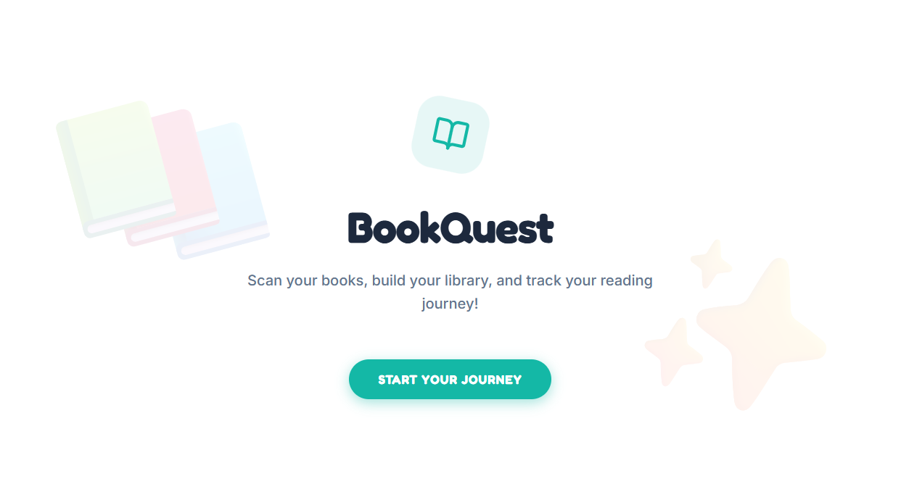

# BookQuest

BookQuest is a playful book catalog app that lets readers sign in with Google, scan a book cover, extract the title and author with Gemini, and save the result to a personal Firebase library.

## Preview



## What It Does

- Google sign-in for personal libraries
- Cover scanning powered by Gemini image extraction
- Firebase Firestore storage for cataloged books
- Search across saved titles and authors
- Book detail cards and a clean, mobile-friendly landing experience

## Tech Stack

- React 19 + Vite
- TypeScript
- Firebase Auth + Firestore
- Gemini API
- Motion and Lucide for UI interactions and icons

## Local Setup

### Prerequisites

- Node.js
- A Firebase project with Authentication and Firestore enabled
- A Gemini API key

### Install

```bash
npm install
```

### Environment

Create a local environment file and set the Gemini key:

```bash
GEMINI_API_KEY="your-gemini-api-key"
APP_URL="http://localhost:3000"
```

The Firebase client configuration is loaded from [firebase-applet-config.json](firebase-applet-config.json), so make sure that file matches your Firebase project.

### Run

```bash
npm run dev
```

The app runs on port `3000` by default.

## Build

```bash
npm run build
```

## Notes

- Book cover scanning sends the image to Gemini and expects a JSON response with `title` and `author`.
- Books are stored per user in Firestore under the `books` collection.
- If scanning fails, the app shows a friendly retry message and keeps the existing library intact.
